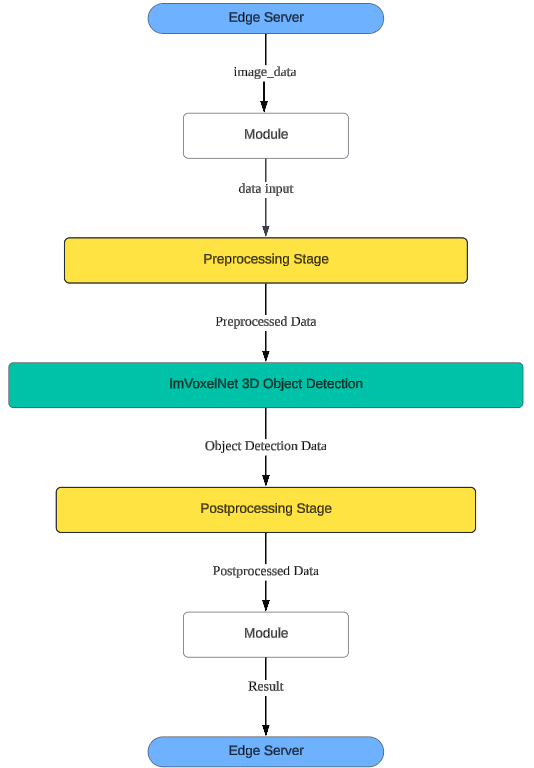

# EasyVizAR supported ImVoxelNet 3D Object Detection Module

This module interfaces with the [EasyVizAR Edge Server](https://github.com/EasyVizAR/edge-server), facilitating automated object detection on images captured by multiple AR headset devices like the Microsoft Hololens2. Leveraging the capabilities of the monocular/multi-view 3D object detector, [ImVoxelNet](https://github.com/SamsungLabs/imvoxelnet), it ensures precise identification of objects within the AR environment. Aligned with [REST API principles](https://learn.microsoft.com/en-us/azure/architecture/best-practices/api-design), our module integrates with the EasyVizAR server implementation, enabling standardized and streamlined communication protocols.

This implementation was based upon EasyVizAR supported [YOLOv8 Object Detection add-on module](https://github.com/EasyVizAR/detect).

## Installation
(Optional) For instructions on setting up an edge server and AR headsets, please refer to the [installation guide](https://easyvizar.github.io/installation.html).

1. Install dependencies.

```console
python3.6 -m pip install --upgrade pip
python3.6 -m pip install -r requirements.txt
```

2. Choose configuration and checkpoint file to use from [ImVoxelNet dataset](https://github.com/SamsungLabs/imvoxelnet/blob/master/README.md#models). By default, it is set to use SUN RGB-D v3 dataset with 37 object labels. Update ModelHandler class initialization accordingly.
```console
detector = ModelHandler([config_path], [checkpoint_path])
```

3. Run the detector.
```console
python3.6 -m detect
```
## Flowchart

  
