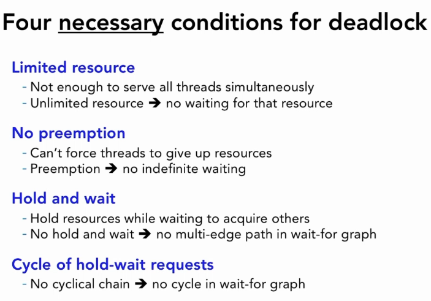

# EasyVizAR supported ImVoxelNet 3D Object Detection Module

This module interfaces with the [EasyVizAR Edge Server](https://github.com/EasyVizAR/edge-server), facilitating automated object detection on images captured by multiple AR headset devices like the Microsoft Hololens2. Leveraging the capabilities of the monocular/multi-view 3D object detector, [ImVoxelNet](https://github.com/SamsungLabs/imvoxelnet), it ensures precise identification of objects within the AR environment. Aligned with [REST API principles](https://learn.microsoft.com/en-us/azure/architecture/best-practices/api-design), our module integrates with the EasyVizAR server implementation, enabling standardized and streamlined communication protocols.

This implementation was based upon EasyVizAR supported [YOLOv8 Object Detection add-on module](https://github.com/EasyVizAR/detect).

## Installation

(Optional) For instructions on setting up an edge server and AR headsets, please refer to the [installation guide](https://easyvizar.github.io/installation.html).

1. Build the Docker image using the ImVoxelNet [Dockerfile](https://github.com/SamsungLabs/imvoxelnet/blob/master/docker/Dockerfile). Replace `image_name` with your preferred name for the Docker image.

```console
docker build . -t {image_name}
```

2. Initialize the Docker container and mount this repository inside it. Ensure GPU access is enabled. Replace `container_name` with your preferred name for the Docker container, `repo_path_outside` with the path to this repository in local machine, `repo_path_inside` with the corresponding path inside the container, and `image_name` with the name of the Docker image from step 1.

```console
docker run -dit --gpus all --name {container_name} -v {repo_path_outside}:{repo_path_inside} {image_name} /bin/bash
```

3. Download [model](https://github.com/saic-vul/imvoxelnet/releases/download/v1.2/20211007_105247.pth) and [configuration](https://github.com/SamsungLabs/imvoxelnet/blob/master/configs/imvoxelnet/imvoxelnet_total_sunrgbd_fast.py) files and place them somewhere accessible by the Docker container. Update ModelHandler class initialization accordingly.

```console
detector = ModelHandler({config_path}, {model_path})
```

4. Run the detector.

```console
docker exec -it {container_name} /bin/bash
cd {repo_path_inside}
python3 -m detect
```

## Configuration

### Threshold Settings

To customize the behavior of the module, adjust the following threshold settings:

- **DUP_DIST_THRES**: If two objects have a distance smaller than this threshold (in meters), they will be counted as duplicated. Adjust this value according to your specific requirements. For example, setting it to 2 meters will consider objects closer than 2 meters as duplicates.

- **DATA_TIMEOUT**: If the data frame is behind the current time by over this threshold (in seconds), it will be ignored for query optimization. Set it to -1 to disable this feature.

Make sure to test the module with different threshold values to ensure optimal performance for your use case.

### Sorting order

Manually change the sorting order of images. By default, images are sorted by priority level (descending), then creation time (ascending). 

```console
for item in items:
    item['priority_tuple'] = (-1 * item.get("priority", 0), item.get("created"))
items.sort(key=operator.itemgetter("priority_tuple"))
```

## Testing

For local testing in a personal AR environment using an AR device and images, please refer to the [installation guide](https://easyvizar.github.io/installation.html) for instructions on setting up and utilizing an edge server and AR headsets. When specifying the server variable, ensure it is set to the localhost address of the edge server.

```console
VIZAR_SERVER = os.environ.get("VIZAR_SERVER", "localhost:5000")
```

For general testing purposes, utilize the [EasyVizAR edge server](https://easyvizar.wings.cs.wisc.edu/) provided by the University of Wisconsin and access images uploaded on the server. Log in to the website using the username "guest" with no password. Please note that this is strictly for testing purposes, and testers should refrain from modifying any data. Set the server variable to the address of the server.

```console
VIZAR_SERVER = os.environ.get("VIZAR_SERVER", "easyvizar.wings.cs.wisc.edu")
```

## Design


